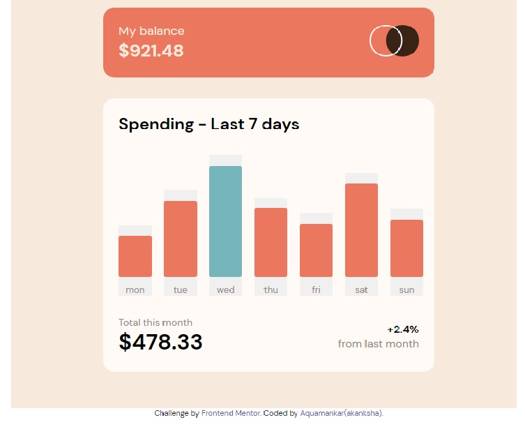

# Frontend Mentor - Expenses chart component solution

This is a solution to the [Expenses chart component challenge on Frontend Mentor](https://www.frontendmentor.io/challenges/expenses-chart-component-e7yJBUdjwt). Frontend Mentor challenges help you improve your coding skills by building realistic projects. 

## Table of contents

- [Overview](#overview)
  - [The challenge](#the-challenge)
  - [Screenshot](#screenshot)
  - [Links](#links)
- [My process](#my-process)
  - [Built with](#built-with)
  - [What I learned](#what-i-learned)
  - [Useful resources](#useful-resources)
- [Author](#author)


**Note: Delete this note and update the table of contents based on what sections you keep.**

## Overview

### The challenge

Users should be able to:

- View the bar chart and hover over the individual bars to see the correct amounts for each day
- See the current day’s bar highlighted in a different colour to the other bars
- View the optimal layout for the content depending on their device’s screen size
- See hover states for all interactive elements on the page
- **Bonus**: Use the JSON data file provided to dynamically size the bars on the chart

### Screenshot




### Links

- Solution URL: [Add solution URL here](https://www.frontendmentor.io/profile/Aquamankar/solutions)
- Live Site URL: [Add live site URL here](https://github.com/Aquamankar/challenge02.github.io.git)

## My process

### Built with

- Semantic HTML5 markup
- CSS custom properties
- Flexbox
- CSS Grid

*

### What I learned


In this challenge i learned few things in js like dom manipulation and inline style for hover using OnmouseMoves. I also use a css property to hover another element by using a "+" sign. 


```css
.column:hover + .black-box{
    opacity: 1;
}
```
```js
01. let drama = ` <div class="big-chart" >';

02.  'onMouseOut="this.style.background='${barCol}''
```


### Useful resources

- [Example resource 1](https://stackoverflow.com/questions/6910049/on-a-css-hover-event-can-i-change-another-divs-styling) - This helped me for hover using inline styling . I really liked this solution.
- [Example resource 2](https://www.codegrepper.com/code-examples/css/on+hover+change+another+element+css) - This is an amazing website which helped me to understand hover effect more clerly. I'd recommend it to anyone still learning this concept.


## Author

<!-- - Website - [Add your name here](https://www.your-site.com) -->
- Frontend Mentor - [@yourusername](https://www.frontendmentor.io/profile/Aquamankar)
<!-- - Twitter - [@yourusername](https://www.twitter.com/yourusername) -->


